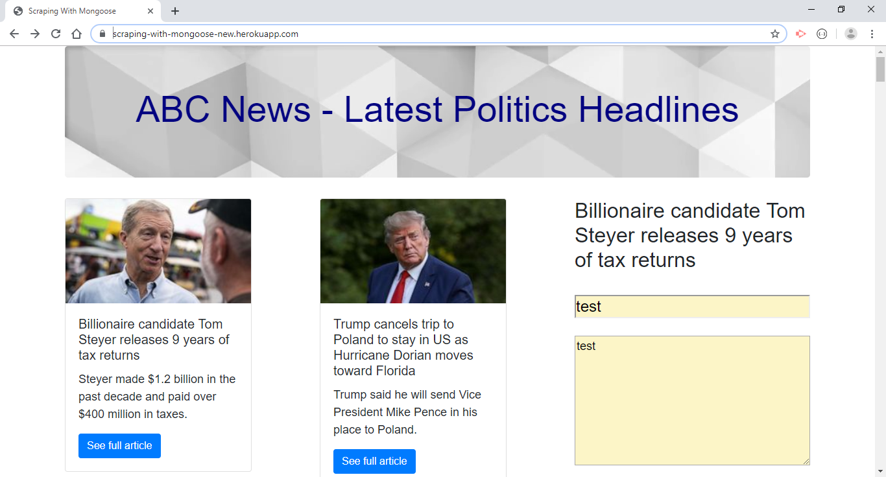

OVERVIEW -   
In this assignment, I created a web app that lets users view and leave comments on the latest news.

NPM INSTALLATIONS -   
•express  
•express-handlebars  
•mongoose  
•cheerio  
•axios  

APPLICATION -   
Whenever a user visits my site, the app scrapes stories from a news outlet of my choice (from ABC News Go - Politics) and display them for the user. Each scraped article is saved to your application database in Robo3T. The app scrapes and displays the following information for each article:

•Headline - the title of the article  
•Summary - one line summary of the article  
•URL - the url to the original full article  
•Photo - the image related to the article  

The users are able to leave comments on the articles displayed (click second line of the article) and revisit them later. The comments saved to the database as well and associated with their articles. All stored comments are visible to every user.  

  
